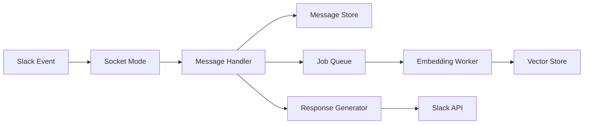
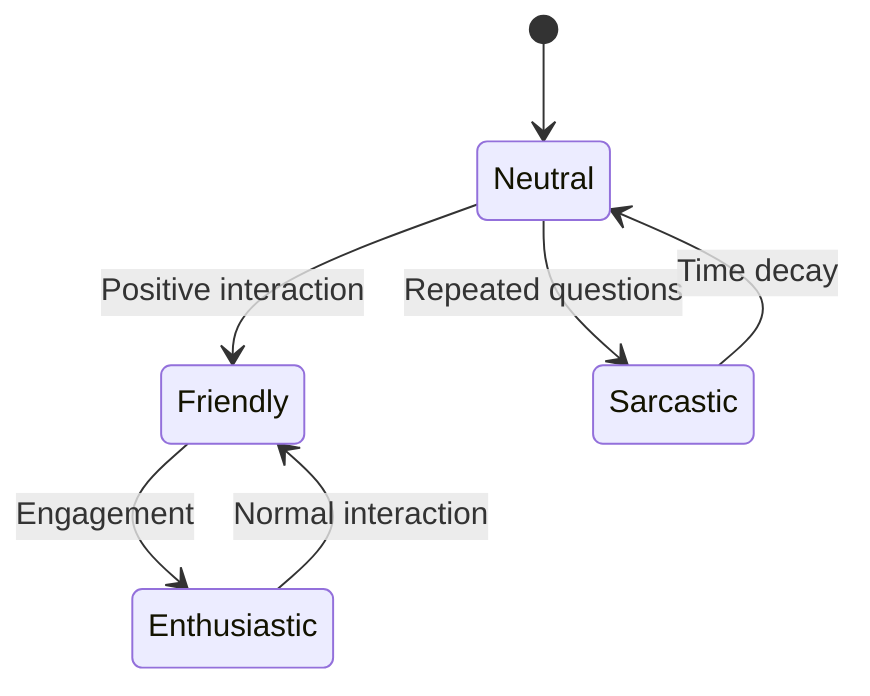

# Architecture Guide

## System Overview

pup.ai v2 is a distributed system built with TypeScript, designed for high availability, scalability, and maintainability. The architecture follows domain-driven design principles with clear separation of concerns.

## Core Components

### 1. Message Processing Pipeline



**Key Design Decisions:**
- **Asynchronous Processing**: Embeddings are generated in background to avoid blocking
- **Event Sourcing**: All messages stored for audit and replay capability
- **CQRS Pattern**: Separate read/write paths for optimal performance

### 2. Memory System Architecture

The memory system uses a hybrid approach combining:

1. **Short-term Memory**: Recent messages cached in Redis
2. **Long-term Memory**: Full history in PostgreSQL with pgvector
3. **Semantic Search**: Vector embeddings for context retrieval

```typescript
interface IMemoryLayer {
  shortTerm: RedisCache;      // Last 24 hours
  longTerm: PostgresVector;    // Full history
  working: InMemoryCache;      // Active conversation
}
```

### 3. Personality Engine

The personality system is built on a state machine pattern:



**Components:**
- **Mood Tracker**: Maintains current emotional state
- **Trait Engine**: Defines consistent personality characteristics
- **Context Analyzer**: Adjusts responses based on conversation history

### 4. Data Layer Architecture

```
┌─────────────────────────────────────────────┐
│              Application Layer              │
├─────────────────────────────────────────────┤
│              Repository Layer               │
│  ┌─────────┐ ┌─────────┐ ┌─────────────┐  │
│  │ UserRepo│ │MsgRepo  │ │InteractRepo │  │
│  └─────────┘ └─────────┘ └─────────────┘  │
├─────────────────────────────────────────────┤
│              Database Layer                 │
│  ┌─────────────┐       ┌─────────────┐    │
│  │ PostgreSQL  │       │    Redis    │    │
│  │ + pgvector  │       │   Cache     │    │
│  └─────────────┘       └─────────────┘    │
└─────────────────────────────────────────────┘
```

### 5. Worker Architecture

Background jobs are processed using BullMQ with the following queues:

1. **Embedding Queue**: Generates OpenAI embeddings
2. **Summary Queue**: Creates daily conversation summaries
3. **Profile Queue**: Updates user personality profiles
4. **Cleanup Queue**: Archives old data

**Queue Configuration:**
```typescript
const queueConfig = {
  defaultJobOptions: {
    attempts: 3,
    backoff: {
      type: 'exponential',
      delay: 2000,
    },
    removeOnComplete: 100,
    removeOnFail: 1000,
  },
};
```

## Scalability Considerations

### Horizontal Scaling

The application supports horizontal scaling through:

1. **Stateless Design**: No server-side session state
2. **Queue-based Processing**: Multiple workers can process jobs
3. **Database Connection Pooling**: Efficient resource utilization
4. **Cache Layer**: Reduces database load

### Performance Optimizations

1. **Vector Index**: HNSW index on embeddings for fast similarity search
2. **Materialized Views**: Pre-computed user statistics
3. **Query Optimization**: Prepared statements and query planning
4. **Batch Processing**: Group operations for efficiency

## Security Architecture

### Defense in Depth

1. **Input Validation**: All user inputs sanitized
2. **Rate Limiting**: Per-user and global limits
3. **Authentication**: Slack signature verification
4. **Authorization**: Role-based access control
5. **Encryption**: TLS for transit, encryption at rest

### Threat Model

Primary threats and mitigations:

| Threat | Mitigation |
|--------|------------|
| Prompt Injection | Input sanitization, output filtering |
| Data Exfiltration | Access controls, audit logging |
| DoS Attacks | Rate limiting, circuit breakers |
| API Key Exposure | Environment isolation, secret rotation |

## Monitoring and Observability

### Metrics Collection

Key metrics tracked:

1. **Response Time**: P50, P95, P99 latencies
2. **Error Rates**: By error type and endpoint
3. **Queue Depth**: Job processing backlog
4. **Memory Usage**: Heap and RSS monitoring
5. **API Usage**: OpenAI and Slack API calls

### Logging Strategy

Structured logging with levels:

```typescript
logger.info('Message processed', {
  messageId,
  userId,
  channel,
  processingTime,
  features: enabledFeatures,
});
```

### Health Checks

Comprehensive health monitoring:

```typescript
interface IHealthStatus {
  database: ConnectionStatus;
  redis: ConnectionStatus;
  openai: APIStatus;
  slack: SocketStatus;
  queues: QueueHealth[];
}
```

## Deployment Architecture

### Container Strategy

Multi-stage Docker build:

1. **Build Stage**: TypeScript compilation
2. **Production Stage**: Minimal runtime
3. **Development Stage**: Hot reloading support

### Environment Management

Environment-specific configurations:

- **Development**: Verbose logging, debug features
- **Staging**: Production-like with test data
- **Production**: Optimized, monitoring enabled

## Future Architecture Considerations

### Planned Enhancements

1. **Multi-Tenant Support**: Workspace isolation
2. **Plugin System**: Dynamic capability loading
3. **GraphQL API**: For analytics dashboard
4. **Event Streaming**: Kafka for real-time processing
5. **ML Pipeline**: Custom model training

### Technical Debt

Current areas for improvement:

1. **Test Coverage**: Increase to 90%+
2. **Documentation**: API documentation generation
3. **Performance**: Query optimization needed
4. **Monitoring**: Add distributed tracing

## Decision Records

### ADR-001: Use pgvector for embeddings
**Status**: Accepted  
**Context**: Need efficient vector similarity search  
**Decision**: Use pgvector over dedicated vector DB  
**Consequences**: Simpler stack, good performance up to 1M vectors

### ADR-002: TypeScript strict mode
**Status**: Accepted  
**Context**: Type safety vs development speed  
**Decision**: Enable strict mode  
**Consequences**: More upfront work, fewer runtime errors

### ADR-003: BullMQ for job processing
**Status**: Accepted  
**Context**: Need reliable background job processing  
**Decision**: BullMQ over custom solution  
**Consequences**: Proven reliability, Redis dependency