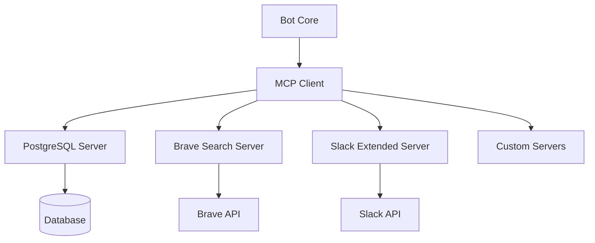

# Model Context Protocol (MCP) Integration

## Overview

pup.ai v2 uses the Model Context Protocol to provide extensible capabilities through modular servers. MCP enables the bot to interact with various services in a standardized way.

## Architecture



## Implemented Servers

### 1. PostgreSQL MCP Server

Provides database operations through MCP protocol.

**Location**: `src/mcp/servers/postgres.ts`

**Capabilities**:
- Query execution
- User profile management
- Message history access
- Vector similarity search

**Example Usage**:
```typescript
const result = await mcpClient.callTool('postgres', 'queryMessages', {
  userId: 'U123456',
  limit: 50,
  similarity: 0.8
});
```

**Available Tools**:
- `queryMessages`: Search message history
- `getUserProfile`: Retrieve user personality profile
- `updateUserProfile`: Update personality traits
- `getSimilarMessages`: Vector similarity search
- `getConversationSummary`: Retrieve daily summaries

### 2. Brave Search MCP Server

Integrates web search capabilities.

**Location**: `src/mcp/servers/brave.ts`

**Capabilities**:
- Web search
- News search
- Image search
- Video search

**Example Usage**:
```typescript
const results = await mcpClient.callTool('brave', 'webSearch', {
  query: 'latest AI developments',
  count: 5,
  freshness: 'week'
});
```

**Available Tools**:
- `webSearch`: General web search
- `newsSearch`: News-specific search
- `imageSearch`: Image search with filters
- `videoSearch`: Video content search

### 3. Slack Extended MCP Server

Provides advanced Slack operations not available in Bolt.js.

**Location**: `src/mcp/servers/slack.ts`

**Capabilities**:
- User presence tracking
- Workspace analytics
- Custom emoji management
- Advanced message formatting

**Example Usage**:
```typescript
const presence = await mcpClient.callTool('slack', 'getUserPresence', {
  userId: 'U123456'
});
```

**Available Tools**:
- `getUserPresence`: Real-time presence info
- `getWorkspaceStats`: Workspace analytics
- `listCustomEmoji`: Custom emoji inventory
- `sendEphemeral`: Send temporary messages
- `scheduleMessage`: Schedule future messages

## Creating Custom MCP Servers

### Server Template

```typescript
// src/mcp/servers/custom.ts
import { MCPServer, Tool, Resource } from '@mcp/server';

export class CustomMCPServer extends MCPServer {
  constructor() {
    super({
      name: 'custom',
      version: '1.0.0',
      description: 'Custom MCP server for specific functionality'
    });
  }

  async initialize(): Promise<void> {
    // Setup server resources
    await this.setupTools();
    await this.setupResources();
  }

  private async setupTools(): Promise<void> {
    this.registerTool({
      name: 'customAction',
      description: 'Performs a custom action',
      parameters: {
        type: 'object',
        properties: {
          input: { type: 'string' }
        },
        required: ['input']
      },
      handler: this.handleCustomAction.bind(this)
    });
  }

  private async handleCustomAction(params: any): Promise<any> {
    // Implement your custom logic
    return {
      success: true,
      result: `Processed: ${params.input}`
    };
  }
}
```

### Registering a Server

```typescript
// src/mcp/client.ts
import { CustomMCPServer } from './servers/custom';

export async function initializeMCPClient(): Promise<MCPClient> {
  const client = new MCPClient();
  
  // Register servers
  client.registerServer('custom', new CustomMCPServer());
  
  // Initialize all servers
  await client.initialize();
  
  return client;
}
```

## MCP Client Usage

### Basic Tool Call

```typescript
import { mcpClient } from '@mcp/client';

async function searchWeb(query: string) {
  try {
    const results = await mcpClient.callTool('brave', 'webSearch', {
      query,
      count: 10
    });
    return results;
  } catch (error) {
    logger.error('MCP tool call failed', { error });
    throw error;
  }
}
```

### Resource Access

```typescript
async function getUserData(userId: string) {
  const resource = await mcpClient.getResource('postgres', `user/${userId}`);
  return resource.data;
}
```

### Batch Operations

```typescript
async function batchProcess(items: string[]) {
  const operations = items.map(item => ({
    server: 'custom',
    tool: 'process',
    params: { item }
  }));
  
  const results = await mcpClient.batchCall(operations);
  return results;
}
```

## Error Handling

MCP operations should always include proper error handling:

```typescript
try {
  const result = await mcpClient.callTool(server, tool, params);
  return result;
} catch (error) {
  if (error.code === 'TOOL_NOT_FOUND') {
    // Handle missing tool
  } else if (error.code === 'SERVER_UNAVAILABLE') {
    // Handle server issues
  } else {
    // Generic error handling
  }
}
```

## Performance Considerations

### Connection Pooling

MCP servers should use connection pooling:

```typescript
class DatabaseMCPServer extends MCPServer {
  private pool: Pool;
  
  async initialize() {
    this.pool = new Pool({
      max: 20,
      idleTimeoutMillis: 30000
    });
  }
}
```

### Caching

Implement caching for frequently accessed data:

```typescript
class CachedMCPServer extends MCPServer {
  private cache: Map<string, CacheEntry>;
  
  async getCached(key: string): Promise<any> {
    const cached = this.cache.get(key);
    if (cached && !this.isExpired(cached)) {
      return cached.value;
    }
    
    const fresh = await this.fetchFresh(key);
    this.cache.set(key, { value: fresh, timestamp: Date.now() });
    return fresh;
  }
}
```

### Rate Limiting

Implement rate limiting for external APIs:

```typescript
class RateLimitedMCPServer extends MCPServer {
  private limiter: RateLimiter;
  
  async callAPI(endpoint: string, params: any): Promise<any> {
    await this.limiter.acquire();
    try {
      return await this.apiClient.call(endpoint, params);
    } finally {
      this.limiter.release();
    }
  }
}
```

## Security

### Input Validation

Always validate inputs in MCP servers:

```typescript
private async handleTool(params: any): Promise<any> {
  // Validate required parameters
  if (!params.userId || typeof params.userId !== 'string') {
    throw new MCPError('Invalid userId parameter');
  }
  
  // Sanitize inputs
  const sanitized = this.sanitizeInput(params);
  
  // Process with validated inputs
  return this.process(sanitized);
}
```

### Authentication

Implement authentication for sensitive operations:

```typescript
class SecureMCPServer extends MCPServer {
  async handleSecureOperation(params: any, context: MCPContext): Promise<any> {
    // Verify caller permissions
    if (!context.hasPermission('admin')) {
      throw new MCPError('Insufficient permissions');
    }
    
    // Perform secure operation
    return this.secureOperation(params);
  }
}
```

## Testing MCP Servers

### Unit Testing

```typescript
describe('CustomMCPServer', () => {
  let server: CustomMCPServer;
  
  beforeEach(() => {
    server = new CustomMCPServer();
  });
  
  it('should handle custom action', async () => {
    const result = await server.callTool('customAction', {
      input: 'test'
    });
    
    expect(result.success).toBe(true);
    expect(result.result).toBe('Processed: test');
  });
});
```

### Integration Testing

```typescript
describe('MCP Integration', () => {
  let client: MCPClient;
  
  beforeAll(async () => {
    client = await initializeMCPClient();
  });
  
  it('should call tools across servers', async () => {
    // Test cross-server communication
    const searchResults = await client.callTool('brave', 'search', {
      query: 'test'
    });
    
    const stored = await client.callTool('postgres', 'storeResults', {
      results: searchResults
    });
    
    expect(stored.success).toBe(true);
  });
});
```

## Monitoring

### Metrics Collection

```typescript
class MetricsMCPServer extends MCPServer {
  private metrics: MetricsCollector;
  
  async callTool(name: string, params: any): Promise<any> {
    const start = Date.now();
    
    try {
      const result = await super.callTool(name, params);
      this.metrics.recordSuccess(name, Date.now() - start);
      return result;
    } catch (error) {
      this.metrics.recordError(name, error);
      throw error;
    }
  }
}
```

### Health Checks

```typescript
class HealthCheckMCPServer extends MCPServer {
  async getHealth(): Promise<HealthStatus> {
    return {
      status: 'healthy',
      uptime: process.uptime(),
      connections: this.getConnectionCount(),
      lastError: this.lastError
    };
  }
}
```

## Best Practices

1. **Keep servers focused**: Each MCP server should have a single responsibility
2. **Use async/await**: All MCP operations should be asynchronous
3. **Implement retries**: Handle transient failures gracefully
4. **Log appropriately**: Include context in log messages
5. **Version your servers**: Use semantic versioning for compatibility
6. **Document tools**: Provide clear descriptions and examples
7. **Handle errors**: Return meaningful error messages
8. **Test thoroughly**: Include unit and integration tests

## Future Enhancements

- **Plugin System**: Dynamic MCP server loading
- **GraphQL Integration**: MCP-to-GraphQL bridge
- **WebSocket Support**: Real-time MCP communications
- **Federation**: Multi-instance MCP coordination
- **Schema Validation**: Automatic parameter validation